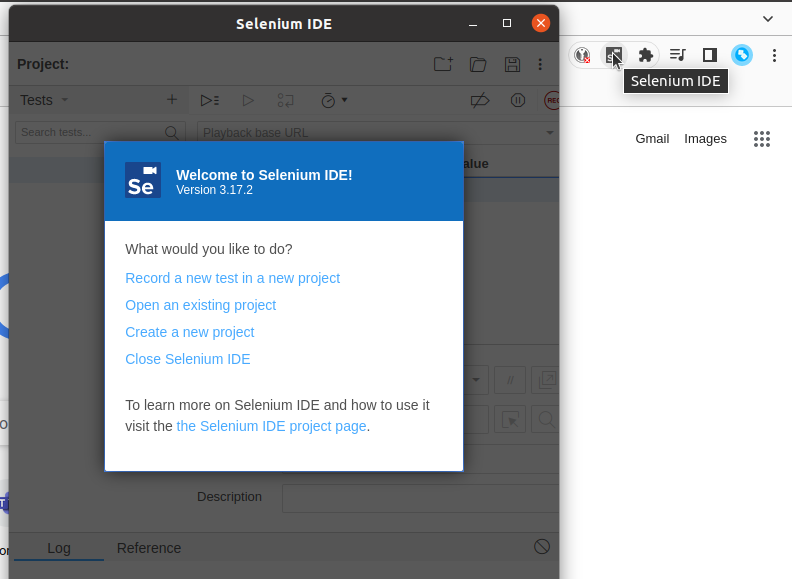

# Setup Selenium IDE in Chrome or Firefox

https://www.selenium.dev/selenium-ide/

[Download](#download)

[Chrome](#chrome)

[Download Tests](#download-tests)

[Running Tests](#run-tests)

## Download the browser plugins to use it. 

Chrome https://chrome.google.com/webstore/detail/selenium-ide/mooikfkahbdckldjjndioackbalphokd

Firefox https://addons.mozilla.org/en-GB/firefox/addon/selenium-ide/

## Chrome 

1. ### Install the Selenium IDE in the Chrome Browser 

2. ### Install the extension 

3. ### Extension Installed

4. ### Pin the Extension to the browser bar

5. ### Open the Selenium IDE 

## Download the selenium test files 

https://github.com/whojarr/selenium-side-manager

## Running Tests 

1. ### Open the Selenium IDE Project Folder "sides/"  

1. ### Open the example Project (most tests are copied from this)

2. ### Project View 

3. ### Open the Test Suites

4. ### Run the default Test

